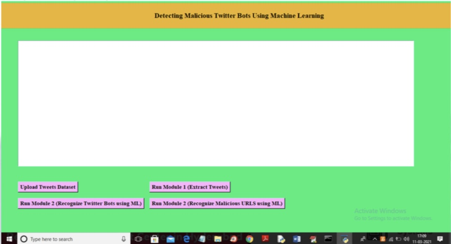
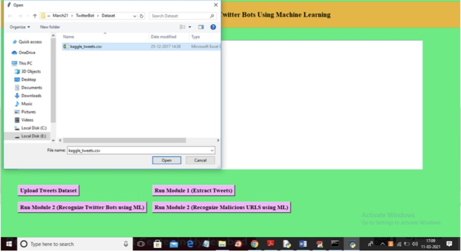
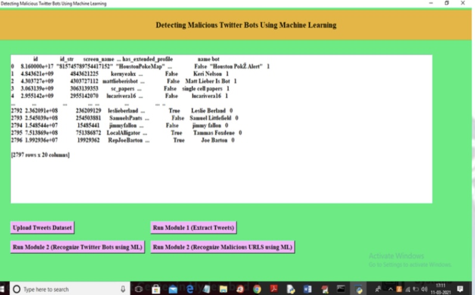
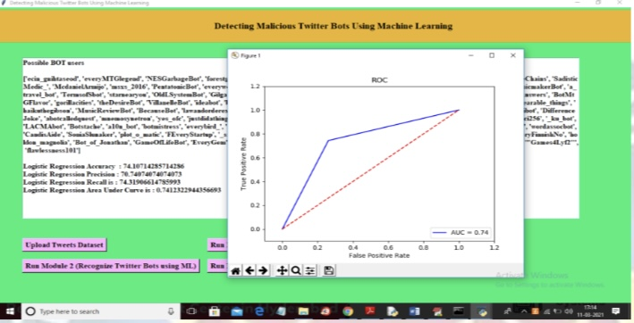
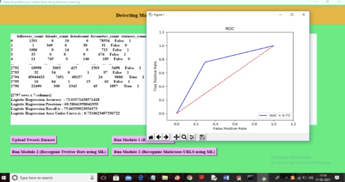

# 🤖 Detecting Twitter Bots using Machine Learning

This project detects malicious Twitter bot accounts by analyzing user behavior and tweet patterns using machine learning algorithms. It uses features like tweet frequency, account age, and follower ratio to classify users as bots or humans. A user-friendly GUI is built with Tkinter for easy interaction.

---

## 📌 Features

- Classifies Twitter users as **bot** or **genuine**
- Uses machine learning models like **Random Forest** and **SVM**
- GUI developed with **Tkinter** for easy usage
- Analyzes features such as:
  - Tweet frequency
  - Followers/following count
  - Account creation age
  - Favorites & retweets

---

## 🛠️ Technologies Used

- **Python**
- **Tkinter** (for GUI)
- **Pandas**, **NumPy**
- **Scikit-learn** (ML models)
- **Matplotlib** (for visualization)

---

## 🚀 How to Run

1. Clone the repository:
   ```bash
   git clone https://github.com/mohammedarqamahmed/twitter-bot-detector.git
   ## 🧠 GUI Screenshots

### 🖼️ Home Screen


### 📂 Dataset Upload Window


### 📊 Display of Extracted Tweets


### 🤖 Bot Prediction Output


### 📈 ROC Curve (Model 1)


### 📈 ROC Curve (Model 2)



